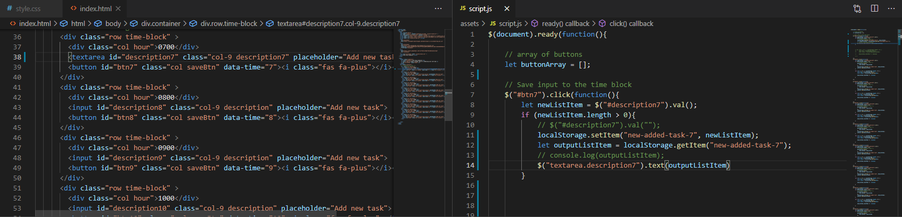
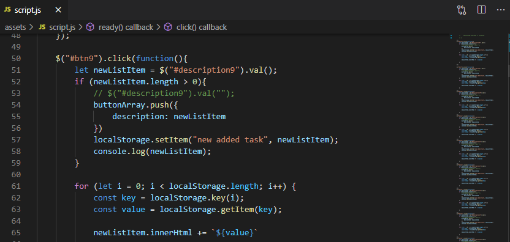
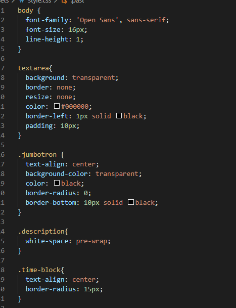
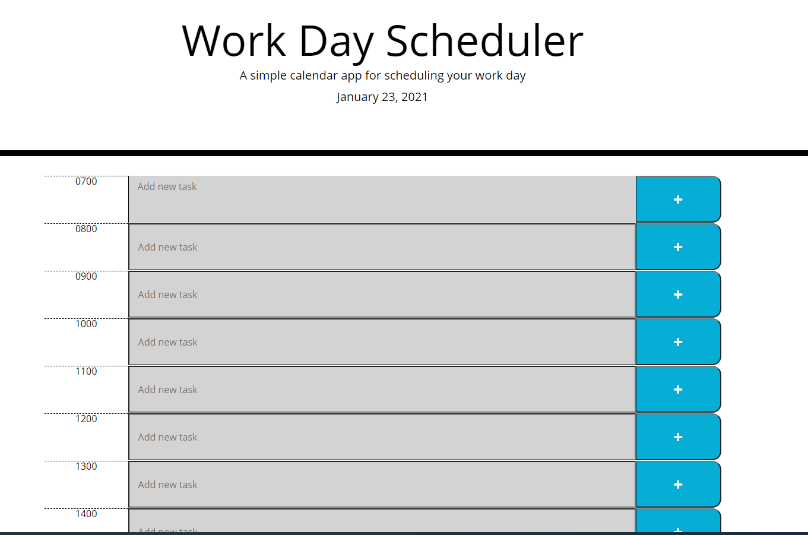

# HW5-Work-Day-Schedule

### What was the expected outcome for this homework?

The main purpose of this project was to create a work day schedule app. This app had to display the current local date. It had to display time blocks so that a user could input new to-do tasks. Those tasks would be also saved onto local storage so that it would stay on the page even after refresh.
Also the time blocks had to be color responsive in correlation to past, current or future hour-time.

### What skills were used in this project?
* HTML-basic
* CSS-basic
* jQuery-intermediate
* use of Local Storage-intermediate
* Moment.js-intermediate
* Bootstrap-intermediate
* fontawsome-begginer

### Main take-aways from project?
The main takeaway from the project was the implementation of third-party-apis and thier use in our app. With moment.js it becomes easier to work with dates and times. Also, the next big takeaway on a personal level was the understanding of using local storage in the app to save input values.

## Finished code 

## Finished Web App

[GitHub:] https://github.com/Milan1422/HW5-Work-Day-Schedule
[GitHubPages:] https://milan1422.github.io/HW5-Work-Day-Schedule/.